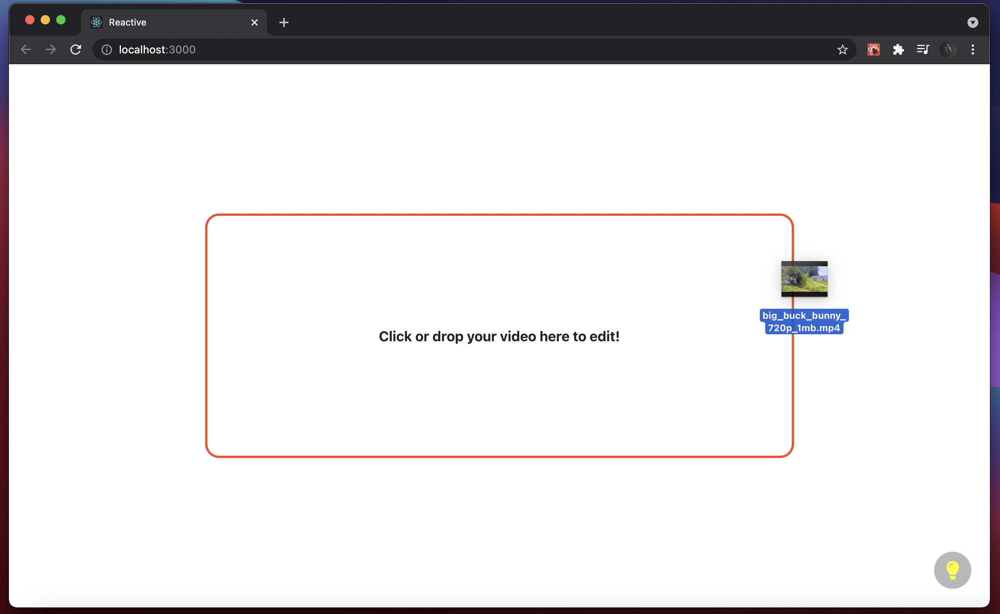
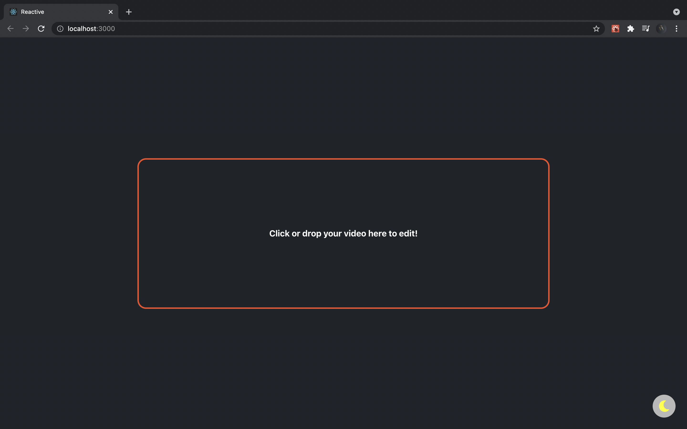
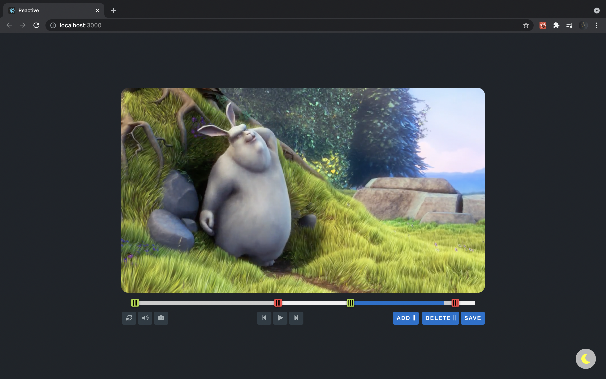

<center></center>

# Reactive: React Video Editor
Reactive is a react based video editor made with the mission to build the simplest yet powerful video editing software. So, buckle up & let's get started!

## Demo
Enjoy reactive here: https://prakshal-jain.github.io/Reactive/

## Install NPM package:
To install reactive NPM package, run ```npm i react-video-editor```
URL: https://www.npmjs.com/package/react-video-editor

## Getting started:
1. Please make sure you have npm installed
2. Clone the repository, and run ```npm install```. This downloads all the dependencies required.
3. Now, it's the time to fire up our server 🚀. Run ```npm start``` to do so.
4. <strong>Congratulations!</strong> You are all set to experience the simplicity of the great in-browser video editing software!

## How reactive is Reactive?
1. Drag and drop your videos to edit.
<div>

</div>

2. Edit based on your mood: Light & Dark themes makes reactive even more user friendly.
<div>

</div>

3. Edit seamlessly
<div>

</div>